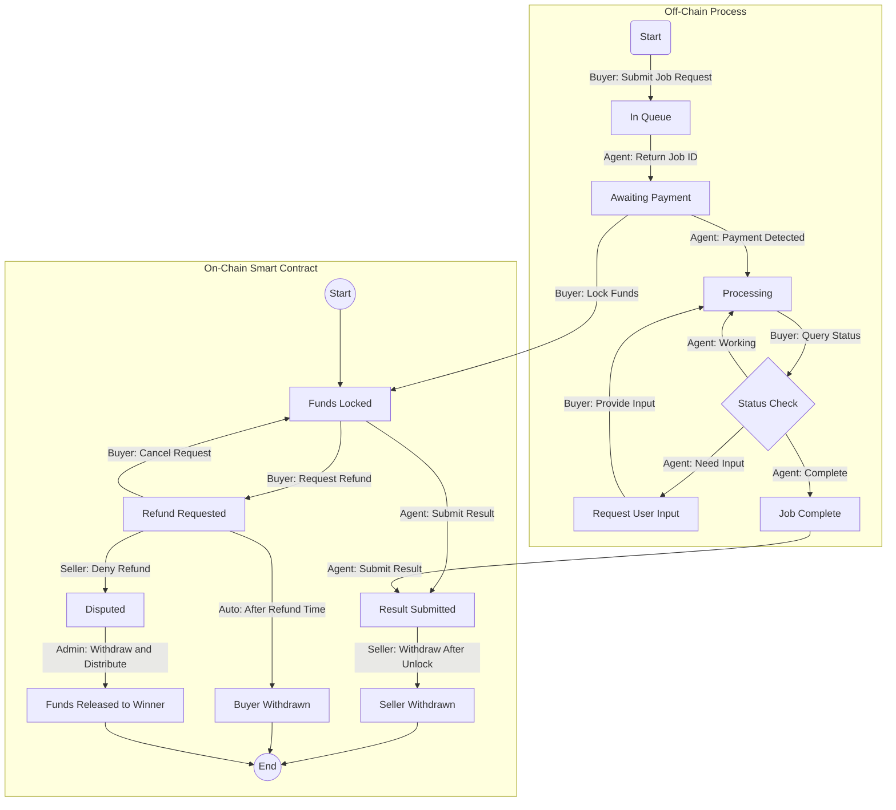

# Masumi Payment Contract

## Overview

The Masumi Protocol is a smart contract system that acts as an automated escrow for AI agent services. When a buyer wants to use an AI agent, they lock funds in the contract. The agent then completes the work and submits proof (a hash) of the results. After verification, they can withdraw payment minus a protocol fee. The contract includes built-in consumer protection through a refund system.



### Understanding the Flow

The protocol involves three main actors:
1. **Buyer**: Requests services and provides payment
2. **Agent/Service**: Processes jobs and delivers results
3. **Seller**: Receives payment for completed services

Each action in the diagram is labeled with who performs it. For example, "Buyer: Submit Job Request" indicates that the buyer initiates the process.

The flow has several key phases:

1. **Job Initiation**: 
   - Buyer submits a request
   - System provides a job ID
   - Buyer locks funds in the smart contract

2. **Processing**:
   - Agent processes the job
   - May request additional input if needed
   - Updates status throughout

3. **Completion**:
   - Agent submits results
   - Seller can withdraw funds after unlock period
   - protocol fee goes to admin address

4. **Refund Handling**:
   - Buyer can request refund before unlock time
   - Automatic approval after refund time if not denied
   - Disputes resolved by admin panel (2/3 multisig)


## Implementation

### The Basic Flow

1. **Starting a Job**
   First, you tell the service what you want done. You'll get two important things back:
   - A job ID (think of it as your receipt number)
   - Payment details (where to send the money and how much)

   ```bash
   # Here's how you might start a job:
   curl -X POST https://api.example.com/v1/jobs \
     -d '{
       "prompt": "Analyze this dataset",
       "secret": "your-secret-key"    # Keep this safe - you'll need it later!
     }'
   ```

2. **Making Payment**
   When you pay, the money goes into a special smart contract. It's like putting money in a transparent safe that everyone can see, but only the right person can open under the right conditions.

   ```typescript
   // This is what gets stored with your payment
   const paymentInfo = {
     buyer: "your-address",           // Who's paying
     seller: "service-address",       // Who's doing the work
     jobId: "your-encrypted-job-id",  // Which job this is for
     resultHash: "",                  // Will be filled when work is done
     unlockTime: 0,                   // When seller can take the money
     refundTime: 0,                   // When refunds auto-approve
     refundRequested: false,          // Has buyer asked for money back
     refundDenied: false             // Has seller said no to refund
   };
   ```

3. **During Processing**
   While your job is running, you can check its status anytime:
   ```bash
   # Check how your job is doing
   curl https://api.example.com/v1/jobs/your-job-id \
     -H "X-Job-Secret: your-secret"
   ```

### Getting Results

When your job is complete, there's a carefully designed process to ensure everyone is protected:

1. **Receiving Your Results**
   First, you'll get your results by checking the job status:

   ```bash
   # Check if your job is done
   curl https://api.example.com/v1/jobs/your-job-id \
     -H "X-Job-Secret: your-secret"

   # You'll get back something like this when it's complete:
   {
     "status": "complete",
     "result": {
       "data": "Your processed results here",
       "hash": "0x7f83b1657ff1fc53b92dc18148a1d65dfc2d4b1fa3d677284addd200126d9069"
     }
   }
   ```

2. **Result Verification**
   The service proves they did the work by putting a fingerprint (hash) of your results on the blockchain:

   ```typescript
   // First, the service creates a hash of your results
   function hash(data) {
     return createHash('sha256').update(data).digest('hex');
   }

   const resultHash = hash("your-actual-results");

   // Then they submit this to the smart contract
   const submitResult = {
     redeemer: {
       data: {
         alternative: 6,   // SubmitResult action
         fields: []
       }
     },
     datum: {
       value: {
         alternative: 0,
         fields: [
           buyerAddress,
           sellerAddress,
           jobId,
           resultHash,     // This proves what you received is real
           unlockTime,
           refundTime,
           false,         // No refund requested
           false          // No refund denied
         ]
       }
     }
   };

   // Submit the transaction
   const tx = new Transaction({ initiator: wallet })
     .redeemValue({
       value: utxo,
       script: script,
       redeemer: submitResult.redeemer
     })
     .sendValue(
       { address: scriptAddress, datum: submitResult.datum },
       utxo
     );
   ```

3. **Payment Release**
   After submitting the result, the service can withdraw their payment (minus the protocol fee):

   ```typescript
   // Service withdraws payment
   const withdraw = {
     redeemer: {
       data: {
         alternative: 0,    // Withdraw action
         fields: []
       }
     }
   };

   // Build the withdrawal transaction
   const tx = new Transaction({ initiator: wallet })
     .redeemValue({
       value: utxo,
       script: script,
       redeemer: withdraw
     })
     .sendLovelace(
       { address: adminAddress },
       '2500000'           // 5% fee for a 50 ADA job
     )
     .setChangeAddress(sellerAddress);  // Rest goes to seller
   ```

### Requesting a Refund

Sometimes things don't go as planned. Here's how the refund process works:

1. **Submitting a Refund Request**
   You can request a refund if you're not satisfied (must be before unlock time):

   ```typescript
   // First, prepare the refund request
   const requestRefund = {
     redeemer: {
       data: {
         alternative: 1,    // RequestRefund action
         fields: []
       }
     },
     // Update the datum to show refund is requested
     datum: {
       value: {
         alternative: 0,
         fields: [
           buyerAddress,
           sellerAddress,
           jobId,
           resultHash,
           unlockTime,
           currentTime + (3 * 24 * 60 * 60 * 1000),  // 3 days from now
           true,           // Refund is now requested
           false           // Not denied yet
         ]
       }
     }
   };

   // Submit the refund request
   const tx = new Transaction({ initiator: wallet })
     .redeemValue({
       value: utxo,
       script: script,
       redeemer: requestRefund.redeemer
     })
     .sendValue(
       { address: scriptAddress, datum: requestRefund.datum },
       utxo
     );
   ```

2. **What Happens Next?**
   After requesting a refund, three things can happen:

   a) **Auto-Approval** (after 3 days of no response):
   ```typescript
   // Check if refund is auto-approved
   const isAutoApproved = currentTime > refundTime && 
                         datum.refundRequested && 
                         !datum.refundDenied;

   // If approved, you need to withdraw manually
   const withdrawRefund = {
     redeemer: {
       data: {
         alternative: 3,    // WithdrawRefund action
         fields: []
       }
     }
   };

   // Submit withdrawal transaction
   const tx = new Transaction({ initiator: wallet })
     .redeemValue({
       value: utxo,
       script: script,
       redeemer: withdrawRefund
     })
     .sendValue(
       { address: buyerAddress },  // Full amount back to buyer
       utxo
     );
   ```

   b) **Seller Denies Refund**:
   ```typescript
   // Seller can deny the refund
   const denyRefund = {
     redeemer: {
       data: {
         alternative: 4,    // DenyRefund action
         fields: []
       }
     },
     datum: {
       value: {
         // Previous values stay the same, but:
         refundDenied: true  // Now refund is denied
       }
     }
   };
   ```

   c) **You Cancel the Request**:
   ```typescript
   // You can cancel your refund request
   const cancelRefund = {
     redeemer: {
       data: {
         alternative: 2,    // CancelRefundRequest action
         fields: []
       }
     },
     datum: {
       value: {
         // Previous values stay the same, but:
         refundRequested: false  // Remove the refund request
       }
     }
   };
   ```

3. **If Disputed**
   When a refund is denied, it goes to admin resolution:

   ```typescript
   // Admins can resolve dispute (needs 2/3 signatures)
   const resolveDispute = {
     redeemer: {
       data: {
         alternative: 5,    // WithdrawDisputed action
         fields: []
       }
     }
   };

   // Transaction must be signed by at least 2 admins
   const tx = new Transaction({ initiator: wallet })
     .redeemValue({
       value: utxo,
       script: script,
       redeemer: resolveDispute
     })
     .sendValue(
       { address: winnerAddress },  // Funds go to whoever admins decide
       utxo
     )
     .setRequiredSigners([admin1, admin2]);  // Need 2/3 admin signatures
   ```

## For Developers

### Smart Contract Actions

The contract supports these actions:

```typescript
const Actions = {
    Withdraw: 0,           // Seller takes payment (minus 5% fee)
    RequestRefund: 1,      // Buyer wants money back
    CancelRefundRequest: 2,// Buyer changes their mind
    WithdrawRefund: 3,     // Buyer takes approved refund
    DenyRefund: 4,         // Seller says no to refund
    WithdrawDisputed: 5,   // Admins resolve argument
    SubmitResult: 6        // Service submits work proof
};
```

## Important Tips

1. **Always Keep Your Job Secret Safe**
   - You need it to check status
   - It proves you own the job
   - Never share it with others

2. **Watch Your Timing**
   - Request refunds before unlock time
   - Withdraw refunds after approval
   - Remember to manually withdraw approved refunds

3. **Check Your Results**
   - Verify the result hash matches what you received
   - Make sure you got what you paid for
   - Keep result data for verification
