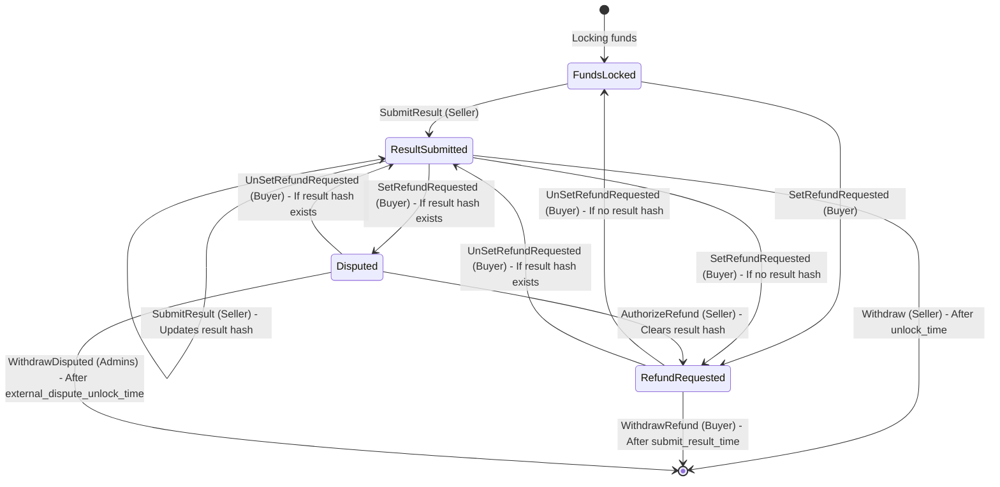

# Vested Payment Smart Contract State Machine

## States

- **FundsLocked**: Initial state when funds are locked in the contract
- **ResultSubmitted**: Seller has submitted a result hash
- **RefundRequested**: Buyer has requested a refund
- **Disputed**: Contract is in dispute state (result submitted but refund is requested)

## Actions and Transitions

## Detailed Action Descriptions

### 1. **Withdraw** (Seller)

- **Triggered by**: Seller
- **From State**: ResultSubmitted
- **Conditions**:
  - After unlock_time
  - Result hash must not be empty
  - Seller must sign the transaction
- **Effect**: Seller withdraws funds (minus fees and collateral return)

### 2. **SetRefundRequested** (Buyer)

- **Triggered by**: Buyer
- **From States**: FundsLocked, ResultSubmitted, Disputed
- **Conditions**:
  - Before unlock_time
  - After buyer_cooldown_time
  - Buyer must sign the transaction
- **To State**:
  - RefundRequested (if no result hash/from FundsLocked)
  - Disputed (if result hash exists/from ResultSubmitted)

### 3. **UnSetRefundRequested** (Buyer)

- **Triggered by**: Buyer
- **From States**: RefundRequested, Disputed
- **Conditions**:
  - After buyer_cooldown_time
  - Buyer must sign the transaction
- **To State**:
  - FundsLocked (if no result hash)
  - ResultSubmitted (if result hash exists)

### 4. **WithdrawRefund** (Buyer)

- **Triggered by**: Buyer
- **From States**: FundsLocked, RefundRequested
- **Conditions**:
  - After submit_result_time
  - Result hash must be empty
  - Buyer must sign the transaction
- **Effect**: Buyer withdraws refund

### 5. **WithdrawDisputed** (Admins)

- **Triggered by**: Network Admins (multi-sig)
- **From State**: Disputed
- **Conditions**:
  - After external_dispute_unlock_time
  - Result hash must not be empty
  - Required number of admins must sign
- **Effect**: Admins withdraw disputed funds

### 6. **SubmitResult** (Seller)

- **Triggered by**: Seller
- **From States**: Any state (FundsLocked, ResultSubmitted, RefundRequested, Disputed)
- **Conditions**:
  - Before submit_result_time OR (before external_dispute_unlock_time AND result hash exists/to update to an other result hash)
  - After seller_cooldown_time
  - Seller must sign the transaction
- **To State**:
  - ResultSubmitted (if from FundsLocked or ResultSubmitted)
  - Disputed (if from RefundRequested or Disputed)

### 7. **AuthorizeRefund** (Seller)

- **Triggered by**: Seller
- **From State**: Disputed
- **Conditions**:
  - After seller_cooldown_time
  - Seller must sign the transaction
- **To State**: RefundRequested

## Key Time Constraints

- **pay_by_time**: Payment deadline
- **submit_result_time**: Deadline for seller to submit result
- **unlock_time**: When seller can withdraw funds
- **external_dispute_unlock_time**: When admins can resolve disputes
- **seller_cooldown_time**: Cooldown period for seller actions
- **buyer_cooldown_time**: Cooldown period for buyer actions

## Cooldown Mechanism

Both buyer and seller have cooldown periods to prevent rapid state changes:

- After any action, the actor must wait for their cooldown period before taking another action
